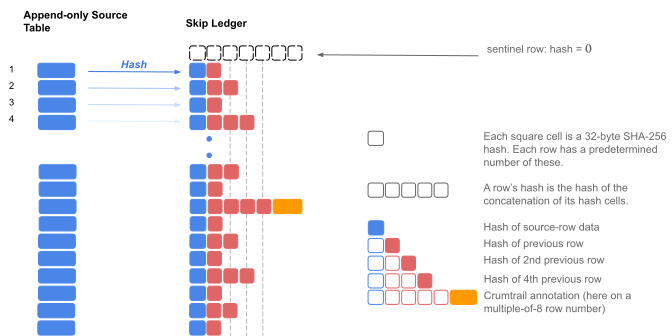

# skipledger

A tamper proof data structure for evolving, append-only lists of objects with efficient proof capabilities.

# Overview

A *skip ledger* (new terminology) is a tamper proof, append-only list of objects represented by their SHA-256 hashes.
Internally, it models a tamper proof [skip list](https://en.wikipedia.org/wiki/Skip_list ).  It's use here is as a tamper proof *list*,
not as a search structure. Here are some of its key differences:

1. *Append only.* Items are only ever be appended to the end of the list. (In skip list terms, the items are ordered in the ordered in they appear.)
2. *Hash pointers.* Instead of the handles, pointers and such in skip lists, the pointers in a skip ledger are hash pointers. (A hash pointer is the hash of another node in the skip list.)
3. *Hash of items only.* We only ever append the *hash* of items, not the items themselves. (Item storage is an orthogonal issue: an item may come from a row in a database table, for example.)
4. *Deterministic structure.* The row number (the index of an item in the list) uniquely determines the number of skip pointers its corresponding node (row) in the list has: unlike a skip list, no randomization is involved.
5. *Efficient verification.* Whereas a skip list is efficient at search, a skip ledger's mojo lies in its efficiency at verification.

So a skip ledger is like a tamper proof linked list, but on link-steroids. The main advantage it offers over a (singly) linked tamper proof list is that you don't need to show the whole list (or any substantial part of it) in order to prove an item's position in the list.

Which ledger? (Which list?) In the same way that the root hash of a Merkle tree uniquely identifies the tree, the hash of the last row (node) in a skip ledger uniquely identifies the ledger (the append-only list). To prove that an item is in the ledger (its hash actually--equivalently) one needs to enumerate a list of linked rows (nodes) from the last row in the ledger (whose hash defines the ledger's state) to the row number (index) at which the item is located. With a skip ledger, the number of rows in such hash proofs is on the order of the logarithm of the number of rows in the ledger.

## Hash Pointers and Row Numbering

A row's number in the ledger uniquely determines how many pointers it has (and which row numbers they point to). An important point to note is that the indexing is 1-based, not zero based: the 1st row added to a ledger is numbered 1. This is mostly for convenience: calculating the number of skip pointers is easier in the 1-based system.

Note conceptually, there is a zero'th row. It is a special sentinel row whose hash evaluates to a string of 32 zero-bytes (as wide as the hash algo requires), the contents of which is undefined.

## Skip (Hash) Pointers

As mentioned above, unlike a skip list, the number of pointers per row is not randomized; it is determined by the largest power of 2 that divides
the row number. If the row number is *r* and 2*n* is that largest power of 2 that divides *r* (*n* = 0 if *r* is odd), then the number of
skip pointers for row *r* is *n* + 1. 

Another way to define the number of pointers is to write down the row number *r* in binary; the number pointers then is 1 plus the number of least significant
zeroes.

## Ledger Rows

Every row in the ledger is composed of a variable number of fixed-width, 32-byte hash cells. If there are *n* + 1 pointers for a row numbered *r*,
then the row contains *n* + 2 hash cells. The first holds the *input-hash*, the hash of the
object in the row. The second cell, which is always present, holds the hash of the previous row (the so-called hash pointer).
The next cells in that row (assuming *r* even) hold the hashes of rows *r* - 21, *r* - 22, .. *r* - 2*n*.

### Row Hash

The *hash* of a row numbered *r* containing *n* + 1 pointers is the SHA-256 hash of a byte sequence of consisting of the row's *n* + 2 hash cells,
ordered as above.

## Ledger State

The hash of the last row uniquely identifies the ledger's state.

## Entry Proof

The *source* of a row, a raw byte-sequence of an object whose SHA-256 hash matches the row's *input-hash* (optionally with parsing
rules for how to generate that hash), together with a sequence of ledger rows connecting the last (latest) row to row in question constitutes a proof
that that *source* object is positioned at a given row number in the ledger with the advertised last-row-hash. The number of rows in
this path goes by the logarithm of the difference in row numbers between the ledger's last row, and the entry's row. So such proofs are compact.

# Motivation

I discovered<small>1</small> the skip ledger structure in an effort to find an efficient hashing strategy for timestamping the state of an *append-only*
list of objects (database rows) using the crums.io REST service. The data structure itself encodes no information about time. (Indeed if
your application can do without historical information in a tamper proof ledger, the library won't encumber you with that stuff.). Witnessing
the hash of the last node of a (hash-pointer-) linked list might do for audit purposes, but the goal here was to find an efficient way to show a 3rd party
a cryptographic proof that a revealed object whose hash is such-and-such must come from the ledger whose state is some advertised hash.

Real world ledgers, depending on what's in them, who, what rules or processes maintain them, have value. In the business world, for example,
ledgers are often audited and reviewed periodically. Today, items (rows) in business ledgers (even audited ones) are seldom made public:
when they are, the information made public is usually in the form of aggregates. We want to change that. If you're a business and a customer
or a contractor trusts your books (to *some* degree), then it should be possible to show them that record in your accounts-payable ledger that
they will be paid on such-and-such date or terms along with a cryptographic proof that links to the advertised hash-state of the payables ledger,
for example. Once you can do that, this ability to tear out a small part of the ledger and prove it belongs without exposing the whole.. it might
help build an evolvable system of cross-ledger transactions.

<small>
1. Skip lists are mentioned as a suitable chaining structure for timestamping in ISO 18014 part 3; I'm not aware of the concept being fleshed out like this tho.
</small>

# Application

## Historical Annotations

Historical information is layered above, and embedded into, a ledger in 2 ways:

1. *Crumtrails.* A crumtrail (crums.io witness record) of a row's hash is annotated to the row. This is establishes the minumum age of the row (and every row
that precedes it).
2. *Beacon rows*. The root hash of the periodic (threaded) Merkle trees that crums.io publishes and keeps track of cannot be computed in advance. These
serve as time beacons and are embedded as special rows in the ledger. The presence of a beacon row ahead of later rows establishes the maximum age of
subsequent rows.

These 2 mechanisms, established by callouts of hashes to the crums.io [REST API](https://crums.io/docs/rest.html ), sandwich time for any interleaving row.
They establish a tamper proof inequality (minimum and maximum age) for any row interleaving (and including) the witnessed and beacon rows. 

### Sans-Beacon Numbering

The presence of beacon rows in a ledger is arguably a wart in the data model. After all, the decision whether or not to insert a beacon row (a timestamping
decision) ought to be orthogonal to the order of operations captured in the ledger. Fortunately, the layer that handles historical information (beacons and
crumtrails) also exposes a sans-beacon numbering scheme. This might allow one to infer, for example, a database table row's position in the ledger simply
by its index in the db table (i.e. without beacon bookkeeping).

## Abbreviated State

In addition to the last row's hash, there is also a more Goldilocks version of ledger state.

### Last-to-First Path

As discussed above, the hash of a ledger's last row uniquely identifies the ledger itself. A hash is a kind of contraction of state (perhaps why it's also called a
digest). But *the skip ledger data structure also offers an intermediate contraction of state, namely the shortest path of linked rows from the last to first.*
This path of rows from end to beginning, called the *state-path*, is used as a richer fingerprint of the ledger than just the hash of the last row.
Again, the size of this representation is logarithmic in the number of rows in the ledger, so it's compact no matter the ledger size.

The advantage with advertising the state of a ledger this way is that if any of these linked hashes (from the last row to the first) intersects with a previously
emitted path from the ledger (when the ledger had fewer rows), then the previous path (e.g. proof that an entry belonged in the ledger at the advertised row
number) can be patched with the new state information. It is a structured hash of the whole that evolves in a way that preserves its lineage. That is, old
state-paths intersect and must fit in the grooves of the new state-path.

The issue where this state information comes from, how it is validated, etc., is a can deliberately kicked down the road. It could be simply advertised over
HTTPS with the existing certificate authority mechanisms. Or the owner of the ledger might insert their public key as the first row, and then periodically
add a public entry (the contents of a row they make public) that is a signature of the previous row's hash. The choices are too many to consider at this
juncture and probably best left to evolve.

## Data Packaging

As mentioned above, this library does not address the storage layer for the *contents* of ledgers. Presently, it knows nothing about that:
the only data model it knows about is an unstructured, 32-byte sequence, the *input-hash* in each row (which *may* be a SHA-256 hash).

### Ledger Databases (.sldg)

The ledger database itself, the layer that only deals in row hashes, is to designed so that it may have a pluggable storage layer. It comes with a default
implementation that directly reads and writes to files in a directory with a `.sldg` extension in its name.

There are 4 files this directory.

1. `ledger` - The append-only skip ledger lives here.
2. `ct_blobs` - Crumtrails are stored here. Since crumtrails come in variables sizes they're simply stored as blobs here.
3. `ct_idx` - Index into `ct_blobs`.
4. `bn_idx` - Beacon row index. Records which rows in the `ledger` are beacon rows.

### Morsels (.mrsl)

Morsels encapsulate information about a subset of rows from a ledger, along with the actual source of some those rows (entries) in a verifiable, tamper proof way.
Here *source* means a byte sequence from which the SHA-256 *input-hash* in the ledger-row can be computed. Whether this is a straight hash of the sequence
or something more structured (eg the root of a small Merkle tree formed by the source byte sequence) is unknown in this alpha release.

Morsel files (`.mrsl` ext) contain information only about a *single* ledger.

## Data Flow Model

The data flow model discussed here does not concern itself with the transport layer. It doesn't have to. When dealing in verifiable,
tamper proof objects it doesn't matter how you got them, thru a website, by email, or numbers and letters scribbled on the back of an envelope.

### Client / Server

The ledger can be thought of as a server of 2 things:

1. A compact but rich "fingerprint" of evolving ledger state (the *state-path*).
2. Morsels of information about certain rows in the ledger.

Both of these can be served as `.mrsl` files.

The clients, of course, are those who got a copy of the `.mrsl` file. Presumably the morsel contains information that's of value to them.
Here's a crude example:

#### Quiz Grade Example

Teacher posts student grades to a ledger, advertises the quiz-ledger's state-path on the school website, and sends each of his students a
morsel containing an entry for the row with their grades. Now if a student needs to show their grade to someone and prove it, they can.
(I don't like the substory in this example--why I called it crude.)

### Morsel Mechanics

Besides getting created at the ledger, new morsels can also be created by combining (merging) existing morsels to produce a new morsel.
If the teacher in the above example uses the same ledger to post grades not just for the one-time quiz but over the course of the semester, then
each student can merge their respective morsels of grades into one personal morsel file for their grades in that course.

 
 
## Command Line Tools
 
There are 3 command line tools in this alpha release. The feature-list is currently minimal, but hopefully enough to hint at where future versions
will be headed.
 
1. `sldg` - tool for creating and maintaining a ledger of hashes. Doesn't know where those hashes came from or what they mean. Includes
commands for recording time. Because it knows nothing about the source of those hashes, this tool is not capable of creating morsels (at least
not in this version). 
2. `mrsl` - tool for inspecting the contents of morsel files, writing their entries (the source bytes matching the hash of a given row) to files and merging
multiple morsel files into one.
3. `jurno` - demo app that keep track of lines in an append-only text file. Because this app knows about the source of the ledger's hashes,
it knows how to create morsels.

The tools' launch scripts are distributed under a `bin` directory; the actual code is
under a sibling `lib` directory.  These tools have a *-help* option explaining their commands. They might be a bit too verbose (better packaged
as man pages maybe).

### A Tour

Let's play with *jurno*, the last app, first (presently, it's the only way to create morsels from the command line). Create a ledger for a text file using *jurno*.
Start with a small text file with maybe just a few lines. If the above `bin` directory is on your path,  the command will look like this:

>
<pre>
$ jurno create mytext.txt    
Created journal with 12 new lines.   
13 crums submitted; 0 crumtrails (witness records) stored   
Run 'update' in a few   
$   
</pre>

Here `mytext.txt` had 12 lines (empty lines don't count) and each line's SHA-256 hash was recorded in the ledger in order.
A beacon row was automatically created as the first row in the ledger, so there are actually 13 rows in the ledger.
This first beacon row establishes the entire ledger was created after the beacon date.

The ledger (a directory) is created as a sibling to `mytext.txt`.

>
<pre>
$ ls -lF  
total 8  
-rw-r--r--  1 babak  staff  1635 Apr 24 12:22 mytext.txt   
drwxr-xr-x  6 babak  staff   192 Apr 24 12:23 mytext.txt.sldg  
$   
</pre>

Before we do anything, let's check on the ledger's status.

>
<pre>
$ jurno mytext.txt status  
 
Lines in file:  22    
  ledgerable:   12   
  ledgered:     12    
 
Beacon rows:    1   
 
                First beacon   
row #:          1   
created after:  Sat Apr 24 12:12:55 MDT 2021                  UTC: 1619287975653   
ref URL:        https://crums.io/api/list_roots?utc=1619287975653&count=-1  
beacon:         d5a7eff5f6eba1abd02ca6b08fea2c1b52ad371b043de719c959497eb9410a3a  
 
Witnessed rows: 0   
 
Ledger state:   deab8ffc80fa4a7b232941347294b11bf297ba1f0cd0de78b87a72050e7c847e  
 
Ledger is up-to-date; 13 rows not witnessed. If you have a network connection, invoking 'update' should fixes this.
</pre>

So let's run *update*. If you haven't taken a coffee break, it'll look something like this:

>
<pre>
$ jurno update mytext.txt  
0 new lines added.  
13 crums submitted; 0 crumtrails (witness records) stored  
Run 'update' in a few
</pre>

Crumtrails (the witness records) take a few minutes to cure (get created). If the server is under adequate load this should
be under 3 minutes. Take a short break and run *update* again.

>
<pre>
$ jurno mytext.txt update
0 new lines added.  
13 crums submitted; 1 crumtrail (witness record) stored
</pre>

You'll notice only *one* crumtrail was stored. That is because the hashes of the rows were witnessed in batch and consequently
their crumtrails all record the same time. But since the last row is linked to every row before it, the other 12 crums are redundant and
silently dropped.

Check the status now.

>
<pre>
$ jurno mytext.txt status  
 
Lines in file:  22   
  ledgerable:   12   
  ledgered:     12   
 
Beacon rows:    1   
 
                First beacon   
row #:          1   
created after:  Sat Apr 24 12:12:55 MDT 2021                  UTC: 1619287975653  
ref URL:        https://crums.io/api/list_roots?utc=1619287975653&count=-1  
beacon:         d5a7eff5f6eba1abd02ca6b08fea2c1b52ad371b043de719c959497eb9410a3a  
 
Witnessed rows: 1   
 
                First crumtrail   
row #:          13    
created before: Sat Apr 24 12:23:41 MDT 2021                  UTC: 1619288621056  
trail root:     2e21787f015821eab5a204edc8784ba707603a13fb26fee3a8bac89885703705  
ref URL:        https://crums.io/api/list_roots?utc=1619288831056&count=-4  
 
Ledger state:   deab8ffc80fa4a7b232941347294b11bf297ba1f0cd0de78b87a72050e7c847e  
 
Journal is complete. Nothing to update.  
OK
</pre>

Add more lines to your text file, a few hundred to make it interesting. Be careful not to edit an existing
line (you can't edit the past). Don't worry about empty lines: they don't matter. (Nor does leading or trailing
whitespace on a line, for that matter.) Then invoke *update* again.

>
<pre>
$ jurno mytext.txt update 
174 new lines added. 
12 crums submitted; 0 crumtrails (witness records) stored 
Run 'update' in a few
</pre>

Run status again.

>
<pre>
$ jurno mytext.txt status 
 
Lines in file:  274  
  ledgerable:   186  
  ledgered:     186  
 
Beacon rows:    2  
 
                First beacon  
row #:          1  
created after:  Sat Apr 24 12:12:55 MDT 2021                  UTC: 1619287975653  
ref URL:        https://crums.io/api/list_roots?utc=1619287975653&count=-1  
beacon:         d5a7eff5f6eba1abd02ca6b08fea2c1b52ad371b043de719c959497eb9410a3a  
 
                Last beacon                                    
row #:          14   
created after:  Sat Apr 24 15:04:11 MDT 2021                  UTC: 1619298251482  
ref URL:        https://crums.io/api/list_roots?utc=1619298251482&count=-1  
beacon:         7f254308dc554975ad8d5a23f7a3baf9dd195250bded20029b7a9ea5f4ebef51  
 
Witnessed rows: 1  
 
                First crumtrail  
row #:          13  
created before: Sat Apr 24 12:23:41 MDT 2021                  UTC: 1619288621056  
trail root:     2e21787f015821eab5a204edc8784ba707603a13fb26fee3a8bac89885703705  
ref URL:        https://crums.io/api/list_roots?utc=1619288831056&count=-4  
 
Ledger state:   4534fa996f246c6681d84ef43193b42f78b9a2ceaec5b2f48d8698955515dfb3  
 
Ledger is up-to-date; 175 rows not witnessed. If you have a network connection, invoking 'update' should fixes this.
</pre>

Give it a few minutes and then invoke update.

>
<pre>
$ jurno mytext.txt update  
0 new lines added.  
12 crums submitted; 1 crumtrail (witness record) stored   
</pre>

Now let's create a morsel for the following *ledgered* line numbers (i.e. lines numbered, not counting those that are blank).

>
<pre>
$ jurno make-morsel mytext.txt 47,50  
2 entries written to morsel: ./mytext.txt-52-49.mrsl  
</pre>

 Let's use the *mrsl* tool to *list* what's in it.
 
>
<pre>
$ mrsl mytext.txt-52-49.mrsl list  
1  
2   
4   
8    
14   A    Sat Apr 24 15:04:11 MDT 2021  
16    
32    
48    
49    E   149 B |rules for how to generate that hash), together with a sequence   
50     
52    E   12 B |# Motivation    
56    
64   
128   
160  
176  
184  
188    W  Sat Apr 24 15:12:17 MDT 2021  
  
18 rows; 1 beacon; 1 crumtrail; 2 entries.  
  
</pre>
 
 (I'm using the source lines of this very file as the lines in `mytext.txt`.) This lists the row numbers in the morsel, along
 with any info available beyond just the hash-cells in the row. If it's a beacon row, it's flagged with an *A* in the next
 column to indicate the row was created after the beacon date in the following column. If there's an entry for a row, it's
 flagged with an *E* and the number of bytes and a snippet of the entry (as text) is shown.
 
 The *mrsl entry* command provides more detail.
 
>
 <pre>
$  mrsl mytext.txt-52-49.mrsl entry 49-52  
 
14          created after Sat Apr 24 15:04:11 MDT 2021  (beacon)   
 beacon:    7f254308dc554975ad8d5a23f7a3baf9dd195250bded20029b7a9ea5f4ebef51   
 ref URL:   https://crums.io/api/list_roots?utc=1619298251482&count=-1   
49          Entry (149 bytes). As text:      
  --------------------------------------------------------------------------------  
rules for how to generate that hash), together with a sequence of ledger rows connecting the last (latest) row to row in question constitutes a proof 
  --------------------------------------------------------------------------------  
52          Entry (12 bytes). As text: 
  --------------------------------------------------------------------------------
 # Motivation
  --------------------------------------------------------------------------------  
188         created before Sat Apr 24 15:12:17 MDT 2021  (crumtrail)  
 ref hash:  ef78f6aef4a4e7cfba8d66428e79f531325d19a2971cacbbb69cf23a57904ea1  
 ref URL:   https://crums.io/api/list_roots?utc=1619298947664&count=-4  
 
2 entries, 1 beacon, 1 crumtrail 
 
</pre>
 
 This concludes the tour. If you've followed along you understand the gist of what the tools and library do. The tools hopefully
 explain the rest thru their `-help` options. Explore the other commands. If you're a developer, jump in.
 
### sldg
 
This is a command line interface to a skip ledger database owned and maintained by the user. It precedes the morsel concept
(the project is a few months old). Regardless, it doesn't know about row sources, so it doesn't know how to create morsels yet.
This interface is more difficult to use but might find use in scripting applications.

 
#### Examples
 
 
To create a new ledger `abc.sldg` in the current directory run
 
><pre>
$ sldg dir=abc.sldg mode=c </pre>
 
To make the first row in the ledger a beacon (thus establishing the *maximum* age
of the ledger) run
 
><pre>
$ sldg dir=abc.sldg addb </pre>
 
To add an entry (example hex input) run
 
><pre>
$ sldg dir=abc.sldg add ff06e7158445a3507dbf2b29140843bdece789d3d9d119871c193e4479e3d82c </pre>
 
To read the status of the ledger run
 
><pre>
$ sldg dir=abc.sldg status </pre>

To add a bunch of hex entries from a file
 
><pre>
$ sldg dir=abc.sldg ingest path/to/entries.hex </pre>
  
Omit the filepath above if the hex entries are to come from *stdin*.
 
To establish the *minimum* age of the ledger's rows run

><pre>
$ sldg dir=abc.sldg wit </pre>
 
Since crumtrails take a few minutes to generate, the above command must be repeated a few minutes hence. One doesn't have to wait for this step to complete, however. More entries may be added in the meantime, however, before the second invocation of `wit`.
 
The following outputs a compact representation of the ledger as a *state path* file to a
an existing `docs` directory:

><pre>
 $ sldg dir=abc.sldg state file=docs/ </pre>

Be careful if `docs` isn't an existing directory, then the above command tries to write the object
in a file named *docs.spath*. (The auto file extension mechanism is overrideable by passing in the
`ext=false` option.

If the `file=docs` argument is not provided then the object is printed to the console in JSON.

# Roadmaps

I released this project early because the possible roadmaps are many. Excepting *jurno*, the demo app that defines what a ledgerable line is, the library does not define
what the objects that are being hashed are, how those objects are to be accessed and so on. These are layers whose design ought to be driven
by use cases. Here's a short list of half-baked suggestions of adaptor widgets:

* Log file adaptor.
* Spreadsheet adaptor. (*jurno* sort of works for `.csv` files.)
* Video chopping adaptor.

Another way to approach this is from the real-world applications side. What semantics do we layer on the contents of a ledger? More semi-baked examples:

* Product label tracking. (Already prototyping this at crums.io.)
* Digital drivers license (and other government records). Each of these is tied to a specific type of government ledger.
* Accounting ledgers. Layer in cryptographic proofs the numbers add up. (I'm not a cryptographer but am hopeful this can be achieved by something like an order-preserving encryption scheme.)
* Bid and ask ledgers. Marketmaker's bid and ask ledger.
* Is there a best way to record a morsel (from another ledger) in this ledger?

The immediate tasks ahead, however, are more mundane, but still interesting.

* Database driver adaptor. ([issue 1](https://github.com/crums-io/skipledger/issues/1 ))
* Improve the command line tools.
* Improve the `.mrsl` file format. Publish a normative description, hopefully after peer feedback. (Right now, it's in comments alongside code.)
* Find a way to express and verify structured hashing for an entry in a morsel file. (The hashing grammar in the crums-core library might help.)
* Rows marking the ledger owner's signature. This might then be packaged in a ledger's state-morsel.

# Thank you

Thanks for reading this far, and if you did, for trying out these tools. I hope this concept of ledgers and morsels has piqued your interest and lights bright
ideas about how you might use them. Feel free to drop suggestions, thoughts, feedback, and yes, code. Let's build this together.

  
Babak Farhang 
April 24 2021

