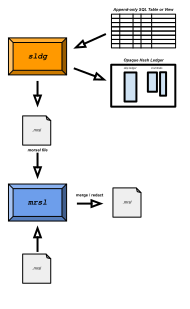

skipledger
========

Tools for maintaining tamper proof evolving historical private ledgers and for disclosing any of their parts in an efficient, provable way.

## Contents

- [Overview](#overview)
    - [sldg](#sldg)
    - [Morsels](#morsels)
    - [mrsl](#mrsl)
- [Library](#library)
- [Data Structure](#data-structure)
    - [Hash Pointers and Row Numbering](#hash-pointers-and-row-numbering)
    - [Skip (Hash) Pointers](#skip-hash-pointers)
    - [Ledger Rows](#ledger-rows)
        - [Row Hash](#row-hash)
    - [Ledger State](#ledger-state)
    - [Entry Proof](#entry-proof)
- [Storage Models](#storage-models)
    - [Skip Ledger Model](#skip-ledger-model)
    - [Morsel Model](#morsel-model)
- [Building](#building)
- [Maven Artifacts](#maven-artifacts)
- [Changes](#changes)
- [Roadmap](#roadmap)


## Overview

Ledgers are historical lists of things. Whether by markings on a stick, carvings in clay, or ink on paper, ledgers have always
recorded human activity. And while the technologies for maintaining the veracity of those records have evolved, one
principle has remained constant: the technology should make tampering with the records difficult (dry clay
is not editable, for eg), so that tampered records are readily apparent.

This then is a modern take on those markings on a stick. It uses cryptographic hashes (SHA-256) in a structured
way (the project's namesake) to construct those markings, as it were. But before drilling down into the details
of the data structure, it helps to first illustrate what we can do with it.

There are 2 principal command line tools: *sldg* and *mrsl. sldg* is used to maintain and
update the history of an *operationally append-only* table or view in a relational database. It supports tear outs
of the table (specific rows) in the form morsel files (`.mrsl` extension). *mrsl*, in turn, is a tool for both reading morsel
files and manipulating (merging/redacting) them.



So in a sense *sldg* is on the server-side (where the owner of the private ledger resides), while *mrsl* is on the
client side (the consumer of the morsel of rows from the ledger).

### sldg

This tool takes a config file as argument. Among other things, the config file (you can name it whatever) specs out the
the SQL query that defines both the order of rows (and their row numbers) in an append-only table or view and the columns
in that view. *sldg* then uses this view to manage a collection of 3 tables of opaque hashes, collectively called the *hash ledger*.
These contain the hash of each row in the above SQL query, as well as auxilliary hashes that encode both the hashes of previous
rows and also occasional witness records (of the rows hashes) that establish the minimum age of rows in the ledger.

Per row, the storage overhead for these hashes is constant (less than 100 bytes) and is independent of the number of
columns defined in the SQL query above.

Besides commands for updating the hash ledger as the source table grows (as new rows are appended as a result of
some business activity), *sldg* can also emit (output) morsels of the ledger's state and its contents in a tamper proof way.

More information is avaliable in the [sldg manual](./sldg_manual.md).

### Morsels

Morsels are compact files containing tamper proof structures that encapsulate information about the ledger's state. They
may contain:

1. *opaque row hashes only*. These are called *state-morsel*s. Such a morsel only reveals how many rows are in the ledger it represents as
well as how the hash of the last row is related to that of the first in the ledger. This information is compact no matter how many rows the ledger has. Think of state morsels as rich fingerprints: as a ledger evolves its new fingerprint can be
validated against its older ones.

2. *source rows*. A morsel may include any reasonably small subset of source rows from a ledger. (Morsels are
designed to be, well.. morsels: they're supposed to fit in memory.) Any column value in these source rows may
have been redacted by its substitution with a hash. (The hashing procedure resists both
rainbow attacks and frequency analysis.)

3. *witness records*. A morsel may also contain one or more tamper proof records (called *crumtrail*s) indicating the time
the hash of a particular row in the ledger (identified by its row number) was witnessed by the `crums.io` service. Since
the hash of every row in the ledger [also] depends on the hash of every row before it, a crumtrail for a given row number
establishes the minimum age of that row and *every row before that row number*.

Morsel files (`.mrsl` extension) originate as outputs of the *sldg* program. Since they're in binary format, we need another
tool to independently validate and read these..

### mrsl

The *mrsl* tool works independently of the *sldg* program: it only deals with `.mrsl` files. Besides its ability validate and
display the information (in either *text* or JSON) from an existing morsel file, it can also be used to:
 
1. *merge morsels*. In most cases, two or more morsels from a same ledger can be merged into a single morsel. In fact, one
way to verify that 2 morsels indeed come from the same ledger is to attempt to merge them. (More precisely, the terms "same ledger"
here mean that one morsel was created from a ledger whose state was the same or an ancestor of the ledger that created the second
morsel. It does not assert anything about whether the descendant ledger is authoritative: see the )

2. *redact information from a morsel*. The recipient of a morsel may desire to share only parts of the information in the
morsel with others. Instead of sharing morsels whole, a user can redact any column values or entire (source) rows from a
given morsel file.

3. *generate PDF*. A morsel may optionally contain a report template. If it does, the user can generate PDF from it.
The template can be customized for such applications as billing, receipts, transcripts--or whatever, the ledger owner designs.


More information is avaliable in the [mrsl manual](./mrsl_manual.md).

## Library

Underlying the above tools is a fairly modular library that allows other storage models than a relational database. In particular,
it includes a direct implementation of the hash ledger on the file system. The *jurno* program demos its use (and was in fact
used for prototyping).

Maven coordinates for these modules are listed [below](#maven-artifacts). 


## Data structure

This section describes the hashing method and data structure used to capture the state of the list in the ledger.

A *skip ledger* (new terminology) is a tamper proof, append-only list of objects represented by their SHA-256 hashes.
Internally, it models a tamper proof [skip list](https://en.wikipedia.org/wiki/Skip_list ).  It's use here is as a tamper proof *list*,
not as a search structure. Here are some of its key differences:

1. *Append only.* Items are only ever be appended to the end of the list. (In skip list terms, the items are ordered in the order in they were added.)
2. *Hash pointers.* Instead of the handles, pointers and such in skip lists, the pointers in a skip ledger are hash pointers. (A hash pointer is the hash of another node in the skip list.)
3. *Hash of items only.* We only ever append the *hash* of items, not the items themselves. (Item storage is an orthogonal issue: an item may come from a row in a database table, for example.)
4. *Deterministic structure.* The row number (the index of an item in the list) uniquely determines the number of skip pointers its corresponding node (row) in the list has: unlike a skip list, no randomization is involved.
5. *Efficient verification.* Whereas a skip list is efficient at search, a skip ledger's mojo lies in its efficiency at verification.

So a skip ledger is like a tamper proof linked list, but on link-steroids. The main advantage it offers over a (singly) linked tamper proof list is that you don't need to show the whole list (or any substantial part of it) in order to prove an item's position in the list.

Which ledger? (Which list?) In the same way that the root hash of a Merkle tree uniquely identifies the tree, the hash of the last row (node) in a skip ledger uniquely identifies the ledger (the append-only list). To prove that an item is in the ledger (its hash actually--equivalently) one needs to enumerate a list of linked rows (nodes) from the last row in the ledger (whose hash defines the ledger's state) to the row number (index) at which the item is located. With a skip ledger, the number of rows in such hash proofs is on the order of the logarithm of the number of rows in the ledger.


### Hash Pointers and Row Numbering

Rows are identified and ordered by row number. Row numbers start at 1 (not zero) and increase monotonically by 1 with the addition
of each new row (no gaps). A row's number in the ledger uniquely determines how many pointers it has (and which row numbers they point to).

Note conceptually, there is also zero'th row. It is a sentinel row whose hash evaluates to a string of 32 zero-bytes (as wide as the hash algo requires), the contents of which is undefined.

### Skip (Hash) Pointers

As mentioned above, unlike a skip list, the number of pointers per row is not randomized; it is determined by the largest power of 2 that divides
the row number. If the row number is *r* and 2<sup>*n*</sup> is that largest power of 2 that divides *r* (*n* = 0 if *r* is odd), then the number of
skip pointers for row *r* is *n* + 1. 

Another way to define the number of pointers is to write down the row number *r* in binary: the number of pointers in the row numbered *r* 
is 1 plus the number of trailing zeroes of *r*, written in binary.


### Ledger Rows

Every row in the ledger is composed of a variable number of fixed-width, 32-byte hash cells. If there are *n* + 1 pointers for a row numbered *r*,
then the row contains *n* + 2 hash cells. The first holds the *input-hash*, the hash of the
object in the row. The second cell, which is always present, holds the hash of the previous row (the so-called hash pointer).
The next cells in that row (assuming *r* even) hold the hashes of rows *r* - 2<sup>1</sup>, *r* - 2<sup>2</sup>, .. *r* - 2<sup>*n*</sup>.

#### Row Hash

The *hash* of a row numbered *r* containing *n* + 1 pointers is the SHA-256 hash of a byte sequence of consisting of the row's *n* + 2 hash cells,
ordered as above.

### Ledger State

The hash of the last row uniquely identifies the ledger's state. As noted above, the state-morsel is a richer fingerprint of state. It's
still manageably small: unlike a straight hash, one can verify whether two distinct state-morsels share common lineage.

### Entry Proof

The *source* of a row, whether a raw byte-sequence of an object whose SHA-256 hash matches the row's *input-hash*, or something
more structured as implemented in this library, together with a sequence of ledger row hashes connecting the last (latest) row to
the row in question constitutes a proof that the *source* object is positioned at a given row number in the ledger with the advertised last-row-hash.
The number of row hashes in this path goes by the logarithm of the difference in row numbers between the ledger's last row, and the entry's row.
So such proofs are compact.

Morsel files allow a tamper proof packaging of these source rows together with such proofs.


## Storage Models

The library uses 2 storage models for ledger data: one for skip ledgers, another for morsels.

### Skip Ledger Model

The skip ledger as depicted in the diagram above contains a lot of redundant information. Indeed, given the source rows, the
entire structure can be recreated from scratch. We obviously don't want to do this for every row access since accessing *n*
rows would cost on the order of *n*<sup>2</sup>.

At a high level (i.e. ignoring how and where this data is represented), the storage model uses the minimum amount of memo-izaton
necessary to allow accessing any given row in [more or less] constant time. Each row contains exactly 2 hash cells (SHA-256 values):

1. the *input hash*, i.e. the hash of the source row
2. the row's (final) hash, computed using the above input hash and previous row hashes (see [Row Hash](#row-hash))

Currently, there are 2 implementations for this storage model: a direct file implementation, and an SQL implementation.
The direct file implementation is faster and more compact; the SQL implementation, tho slower, is in a more familiar (standard)
setting.

Constructing a *complete* skip ledger row under this model (which contains both the input hash and the row's hashpointers to previous rows) then
takes on average 3 row accesses: one for the row's input hash, and 2 for its hash pointers to previous rows (on average, each row has 2 hash pointers).
In a good many cases, however, we don't need the full row object: therefore the library also offers *lazy* versions of its row abstraction.

### Morsel Model

Morsels, on the other hand, employ a different storage model. No memo-ization is involved: they are designed to contain
the minimum information necessary to construct the data's hash proofs. Accordingly, a morsel records each row from the
skip ledger using a *single* hash cell that is either the row's input hash or, if the row is only referenced
(via one or more hash pointers from higher numbered rows), the row's (final) hash.

The file format is documented [here](./morsel_file_format.txt).


## Building

Building is supposed to be easy. Please report any problems.

### Requirements

The build system uses Maven 3 and for now requires JDK 17+. (If you need compiled binaries
for older versions of Java, do let me know. For now, development tends not to be hamstrung with such
considerations.)

### Maven Incantations

To build this project, clone this repos and invoke

    $ mvn clean install -DskipTests

from the project's root directory. However to run the tests also, you'll need to build and install a
*test dependency* locally. Clone the [junit-io](https://github.com/gnahraf/junit-io) project and invoke

    $ mvn clean install

in *that* project's root directory: you can then invoke the same build command in this project's
directory in order to run the unit tests.

To build the *sldg* and *mrsl* tools:


    $ cd sldg
    $ mvn package appassembler:assemble -DskipTests
    $ cd ../mrsl
    $ mvn package appassembler:assemble -DskipTests


## Maven Artifacts

Version `0.5.0` is the first release that becomes available from Maven Central.

### SNAPSHOTs

The latest development version `0.5.1-SNAPSHOT` is available from the *snaphots* repo.
The POMs already describe its location, but here it is in case you want to use it in another POM file.

```
  <repositories>
    <!-- For SNAPSHOT releases -->
    <repository>
      <id>ossrh</id>
      <url>https://s01.oss.sonatype.org/content/repositories/snapshots</url>
    </repository>
  </repositories>
```

Note artifacts in this repo always have the `-SNAPSHOT` moniker appended to their version strings.

### skipledger

The base module. Defines the hash ledger (a skip ledger annotated with crumtrail
witness records), the morsel file for packaging proofs, and a data model for hashing arbitrary data from a
*source ledger*.

```
    <dependency>
      <groupId>io.crums</groupId>
      <artifactId>skipledger</artifactId>
      <version>0.5.0</version>
    </dependency>
  
```
### skipledger-sql

SQL implementation and modeling of a source ledger via an SQL query and backing storage for
the hash ledger in the relational database.

```
    <dependency>
      <groupId>io.crums</groupId>
      <artifactId>skipledger-sql</artifactId>
      <version>0.5.0</version>
    </dependency>
  
```
### reports

PDF report generator from JSON DSL (the report template).

```
    <dependency>
      <groupId>io.crums</groupId>
      <artifactId>reports</artifactId>
      <version>0.5.0</version>
    </dependency>
```

The next 2 modules are CLI tools, not libraries. There should be little occasion to include
these as a dependency; maybe convenient for distribution purposes, however.

### sldg

CLI tool used by ledger owners to monitor, track, and optionally report morsels of their ledger's state.

```
    <dependency>
      <groupId>io.crums</groupId>
      <artifactId>sldg</artifactId>
      <version>0.5.0</version>
    </dependency>
```

### mrsl

CLI tool for verifying and displaying information from standalone `.mrsl` files, generating PDF reports
from them, as well as manipulating the `.mrsl` files themselves (merging or redacting content from them).

```
    <dependency>
      <groupId>io.crums</groupId>
      <artifactId>mrsl</artifactId>
      <version>0.5.0</version>
    </dependency>
```

## Changes

Version `0.5.0` is both a maintenance- and *new-feature* release.


### Maintenance

- **JPMS Modularization.** Maven submodules were JPMS modularized (the Java Module System). So were
its other `io.crums` dependencies. This allows bundling applications with a custom JRE that's smaller
than a standard runtime.
- **Maven Central Deployment.** The modules defined in this project (and their dependencies on other
`io.crums` projects) are now deployed to central.

### New Features

- **Better CLI.** This release uses the *picocli* library for prettier, more intuitive / helpful
command line interfaces.

- **Report Templates.** `.mrsl` files can now embed a customizable template for generating PDF reports
from ledger data in a morsel. The idea is to allow the ledger owner create branded documents
from their ledger entries for such things as bills, receipts, or any other documents they might invent.


## Roadmap

The following are planned for the next releases:

- Reports:
    * Add more arguments types that PDF templates can take (right now they're only numeric)
    * Add template maker tools
    * Add support for displaying images from the ledger data
    * Embed `.mrsl` hashes in PDF, so that a standalone PDF can be validated against the current
    fingerprint of the ledger
- Package the *mrsl* and *sldg* tools for end-user distribution

After that..

- Allow adding other optional appendages to morsel files: pub key + signatures, and user (ledger owner) defined legalese docs.


